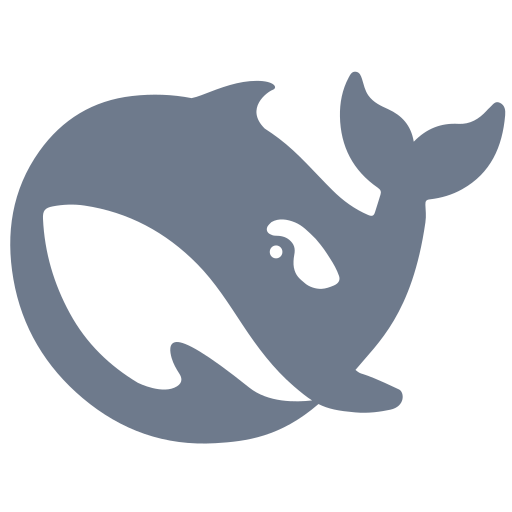

<div align="center">


\# 🐳 DeepSeek Harness Desktop





\### ✨ 把 `npx @deepseek-ai/dsh web` 变成 Windows 一键启动应用


</div>


\---


> ⚠️ \*\*重要声明\*\*：本项目\*\*不是\*\* DeepSeek 官方产品，仅为 Windows 桌面封装启动器。DeepSeek Harness 版权归 DeepSeek 所有。


\## 🚀 核心特性


| 特性 | 说明 |

| :--- | :--- |

| \*\*🖥️ 零门槛使用\*\* | 双击 `DeepSeek Harness.exe` 即可启动，\*\*无需安装 Node.js，无需输入命令\*\*。 |

| \*\*🔒 数据分离\*\* | 程序本体在 `Program Files`，用户数据（API Key、聊天记录、插件）存储在 `%USERPROFILE%\\.dsh`，\*\*更新/重装不会丢失数据\*\*。 |

| \*\*🧩 插件支持\*\* | 支持 Cordis 插件和普通 NPM 包，完全兼容原版 Harness 生态。 |

| \*\*🐳 专属图标\*\* | 内嵌 <span style="color:#6E7A8C; font-weight:bold;">\*\*灰色鲸鱼\*\*</span> 图标，桌面上易于识别。 |


\## 📦 安装方式


<span style="color:green; font-size:1.2em;">\*\*✅ 推荐：安装版\*\*</span>


下载 `DeepSeek-Harness-Setup.exe` → 双击 → 自动安装到 `C:\\Program Files`，并生成快捷方式。


<span style="color:orange; font-size:1.2em;">\*\*📂 便携版\*\*</span>


下载 `DeepSeek-Harness-Portable.exe` → 复制到任意位置 → 双击直接运行，无需安装。


\## 📚 详细文档


> 如果你准备发布，建议你根目录新建一个 `docs/` 文件夹，放以下 3 个 Markdown 文件：


1\. \[\*\*如何安装插件\*\*](docs/PLUGIN.md) (无需重新打包)

2\. \[\*\*如何更新 Harness 版本\*\*](docs/UPDATE.md) (一条 PowerShell 命令搞定)

3\. \[\*\*常见问题\*\*](docs/FAQ.md)


\## 🔧 维护与构建


如果你是开发者，需要重新构建 EXE，请在源码目录执行：


```powershell

powershell -ExecutionPolicy Bypass -File scripts\\build.ps1

